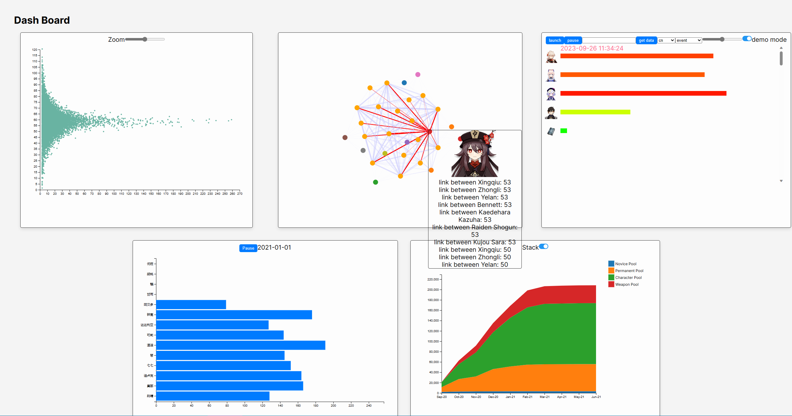

# Stats401-Final

- This project is a visualization of Genshin Impact, specifically its Gacha system and abyss team composition.
- All graphs are built with D3.js.
- Developed with React (Next.js).

### Setting up

- run `cors-anywhere`
  - needed if request data from miHoYo
  - see explaintion below
- run `my-app`
  - `npm install`
  - `npm run dev`

### Demo

- 

### Technical Considerations

#### same-origin policy

- due to same-origin policy, we cannot read data sent to miHoYo Gacha Api in browser
- workaround: using `cors-anywhere` as a proxy server
- this affects our player Gacha record visualization, and for the ease of demostration, we use local data for demo.

#### performance

- we plan to implement zooming in automatically reduces the size of circle.
- the first graph is composed of many `<circle>`s, when one scroll the mouse scroll whell, it emits tens or hundreds of zooming event events.
- adding them and removing them on screen takes much memory, and that's why we have to set the radius in advance.